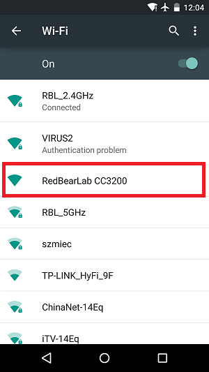
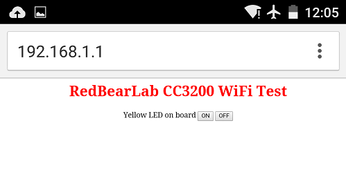

# Getting Started with CC3200

This getting started guide will show you how to develop an application for RedBearLab CC3200 or WiFi Mini board using Energia, an open-sourced version of the Arduino IDE for Texas Instruments MCU.

## Out of the Box Test

* Power on the RedBearLab CC3200 or WiFi Mini board by using an micro USB cable and connect it to a host PC or an USB power source/battery. Both the on-board power indicator LED (ON) and the I/O indicator - LED (L) should be on.

* From your PC or smart phone, go to the WiFi setting page. You should see an Access Point (AP) which the SSID name "RedBearLab CC3200" on the AP scan result list. Choose the "RedBearLab CC3200" AP to connect to it. This AP's secure type is open and you can connect to it without any password.

	

* Open a web browser (e.g. IE/Safari/Chrome) on your PC or smart phone. Type the AP's IP address, which is "192.168.1.1", into the web browser address bar and go. It will show the welcome message "RedBearLab CC3200 WiFi Test" and two buttons to allow you to turn on or off the on-board yellow I/O indicator - LED (L).

	

* Press the "ON" or "OFF" button on the web page and see the state of the on-board IO indicator - LED (L) to verify your board is fully functional.

## Using Energia

* Download Energia and install it on your PC.
* For Windows users
	* please download and install the USB Interface device driver at https://developer.mbed.org/media/downloads/drivers/mbedWinSerial_16466.exe
	* please follow the instructions under the "CC3200 LaunchPad" section on How to set up Energia on Windows to install the CC3200 Drivers for Windows.
* Open the Energia IDE. Click on the "File > Examples > 1.Basics > Blink" to open the blink sketch.
* Click on the "Tools > Board" on the menu bar. The RedBearLab CC3200 and WiFi Mini boards have been added to the IDE. Select the board you are using.
* Click on the "Tools > Serial Port" to choose the serial port for your WiFi board.
* Click on the right arrow button on the tool bar to compile and upload the shetch to your WiFi board.
* After uploading the sketch, push the on-board reset button to run. You will see the on-board I/O indicator - LED (L) toggling in every second interval.