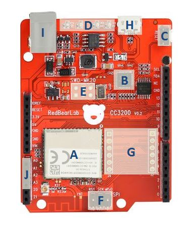
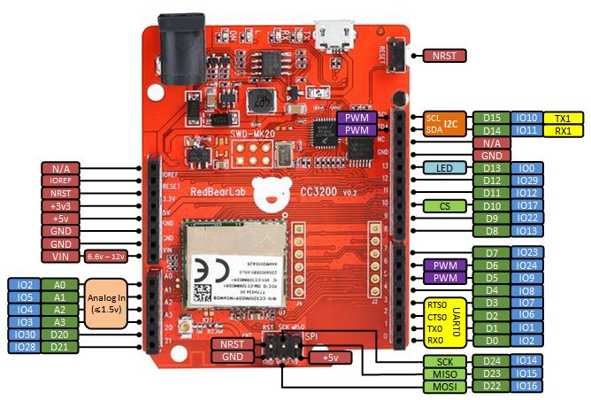
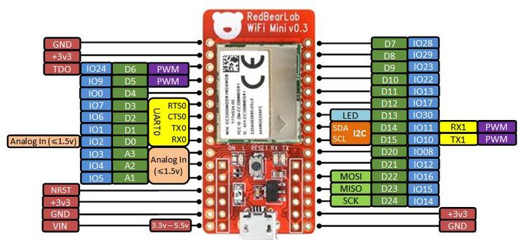
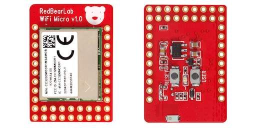

# RedBear CC3200 Wi-Fi Series

Last updated: 2016/01/06

## Introduction

[RedBear WiFi CC3200, WiFi Mini and WiFi Micro](http://redbear.cc/) are the development boards with low power WiFi capability, they are designed for fast prototyping of IoT projects.

This repository contains the resouces for RBL CC3200 WiFi development boards. To start development using the [Energia](http://energia.nu/download/) IDE for these three boards on Windows, Mac OSX and Linux platforms, please follow the following instructions.

## RBL CC3200

## WiFi Mini

## WiFi Micro

## Getting Started

* Follow the [Getting Started Guide](docs/Getting_Started_with_CC3200.md) to test the board out of the box. This will make sure your board is functional.

* To start doing your own firmware development for the CC3200 boards, download and install the [Energia](http://energia.nu/download/) on your PC.

## Install USB CDC Driver (Windows Only)

Get [this driver](https://mbed.org/media/downloads/drivers/mbedWinSerial_16466.exe) and install it if you are using Windows, so that you can use the USB CDC (Virtual COM Port).  

## Install CC3200 LaunchPack Driver (Windows Only)

The uploader program -- cc3200prog.exe requires ftdxx.dll to run, already included in this add-on, but if you have any problems, download and install [CC3200 LaunchPack Driver](http://energia.nu/guide/guide_windows/) to try.

**Note that you do not need any driver for the OSX and Linux platforms.**

## Starting Coding

Now you can develop the RedBearLab CC3200 firmware using the Energia IDE. Enjoy it!

## Updating MK20 Interface Firmware (optional)

The MK20 firmware provides USB CDC to the system to download sketch to the CC3200. 

Steps to update the firmware:

1. Download the firmware from
    https://github.com/RedBearLab/RBL_CC3200/tree/master/MK20

2. Press and hold the button on the board, connect it to an USB of your PC, it will enter to the MK20 bootloader mode

3. The PC will prompt a drive named "bootloader", the LED on the board will flash slowly

4. Drag and drop the firmware (.bin) to the drive, after that, the LED on the board will flash very fast

    For Mac OSX (e.g. 10.10.3), you need to use command line (Terminal) with the follow command:
    
      sudo mount -u -w -o sync /Volumes/BOOTLOADER ; cp -X ~/Downloads/CC3200_MK20.bin /Volumes/BOOTLOADER/

5. Remove it from the USB and use it as normal to upload sketches

## Resources

TI CC3200 Official Forum

https://e2e.ti.com/support/wireless_connectivity/f/968

TI CC3200 Official Wiki

http://processors.wiki.ti.com/index.php/CC31xx_%26_CC32xx

RBL CC3200 Boards Support Forum

https://redbearlab.zendesk.com/forums/21199609-RBL-CC3200-WiFi-Mini

Energia Forum

http://forum.43oh.com/forum/28-energia/
